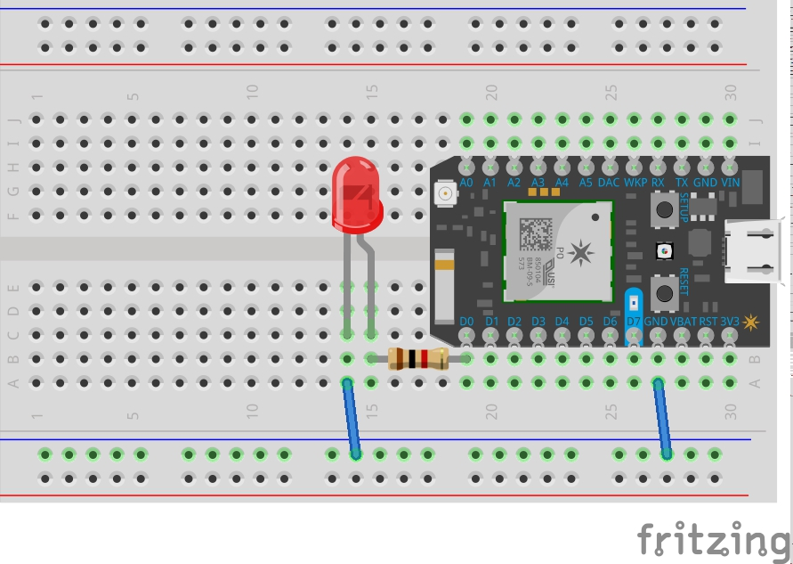
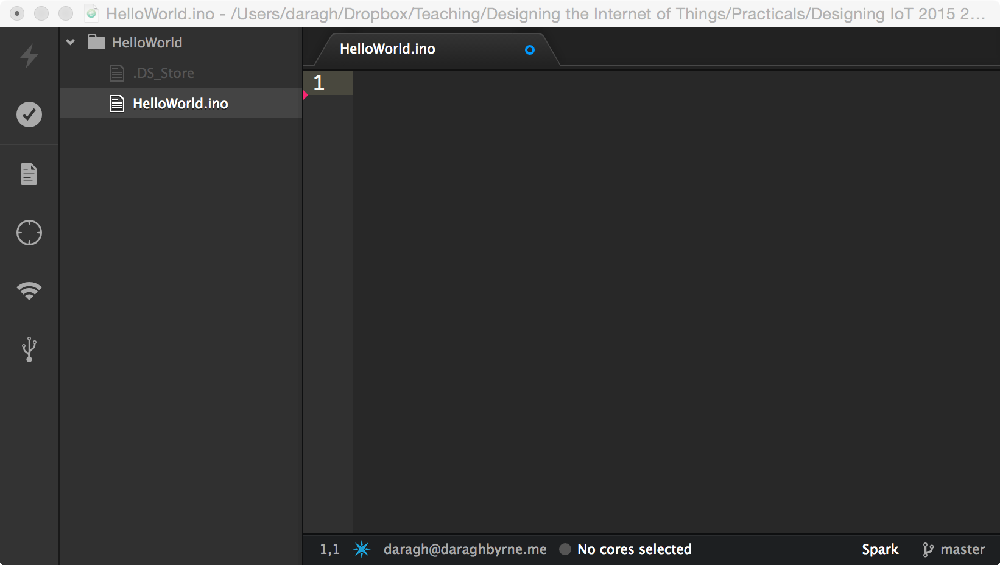
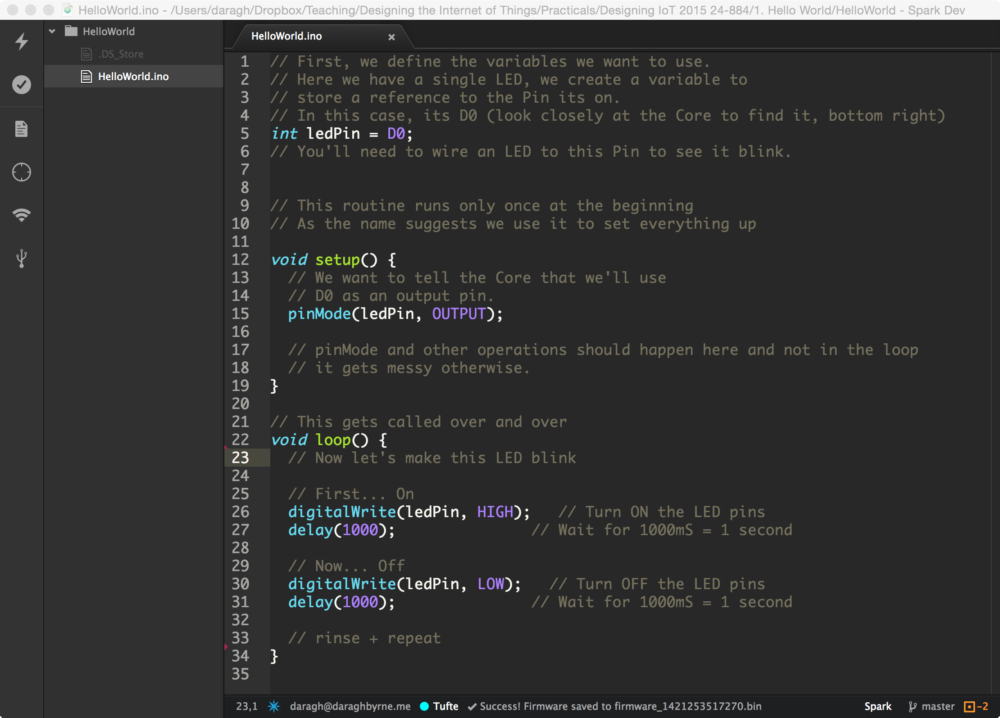

# Step 1: Making a Blinking LED

## Circuit

First things first, we'll make the circuit that our Photon will control!

- __Add an LED (long leg closest to the pin)__
- __Add a 1KOhm resistor to connect it to `D0`__
- __Complete the circuit to ground__



To make this circuit you need a Particle microcontroller, an LED, a 1KΩ resistor (brown, black, red)

Along your Particle device you will see a series of PINs or legs labeled `D0` to `D7`. These are the digitalPins which can be used for input or output. In this case we’ll be using them for output or to turn power on and off to make the LED blink.

First connect a 1K Ohm resistor (brown,black red)
- One end of the resistor goes to a breadboard terminal directly beside the pin marked D0 
- The other end can go to any other row on the breadboard. 

Next add an LED with the anode (longer leg) to the same row where the resistor connects. 
The pin at `D0` will provide power when it is turned on.

Next we need to connect the cathode to ground. Use your jumper wires to make a connection to the negative column of the power rail (marked in with the blue line)

Finally, near the `GND` pin use another jumper cable to connect it to the power rail as shown. Now we have a _complete circuit_ where power from Pin `D0` will always flow to ground.

## Getting Ready to Program

We have our circuit ready… now we can use Particle Dev to tell it what to do.

Open it up and open a new Window if needed. Then choose the `File` menu and `Save`. Create a new folder called `LedBlink` and save the sketch inside it as `LedBlink.ino`  __Notice the folder and the file name are the same__  We need to include a ‘.ino’ extension on our files so that the development environment recognises it as code for our microcontroller.

Your development environment should now look like this:




## Starting a Sketch

Our sketches for a Photon will always start the same way.

Every sketch needs two functions or blocks of code to exist. The first is `setup()` and the other is `loop()`. Setup is called once every time the program is run. This happens when the program is first put on the microcontroller, every time it is powered on and every time the reset button is pressed.

````

// This is where we add variables or bits of 
// information we'll use in our program


// The setup is run once. It's called when the 
// microcontroller first launches 
void setup()
{
}

// This is called repeatedly, hence it's name - loop!
// the code here gets executed over and over again
// once it reaches the bottom it starts over

void loop()
{

}

````

Copy and paste this code into Particle Dev and we'll start to add some basic stuff to make interactive!

### Writing your first Sketch

Now, let’s write some code.



This is the program that you'll create. You’ll find the code for this example in this folder or you can feel free to just type it in from below.

Before we do that, let’s explore what’s happening here line by line.

### Defining Variables

The first line of our program is the following.

```int ledPin = D0;```
We have declared a variable of type `integer` and called it `ledPin`; that means that the variable called ledPin can only hold a whole number.

We’ve also assigned this variable a reference to pin `D0`. Basically, we’ve created a variable we can use to tell other stuff in the program that we want to do things with Digital Pin Zero.

### Setup `setup()`

Within the setup function, the microcontroller expects us to tell us how we want to use it. One of the most common things to do, is declare how the pins will be used. Digital Pins (and some other pins) can be used for input and output. So when we want to use a PIN we first need to say which of the two it will be used for.

The first command in our program does exactly this.

````
void setup() {
  // We want to tell the Photon that we'll use
  // D0 as an output pin.
  pinMode(ledPin, OUTPUT);
}
````
Remember that `ledPin` is a variable that maps to the digital pin zero (`D0`).

### Digital Write

We’re going to use a command called `digitalWrite` to control the pin at `D0`. It’s called a digital pin because its basically like binary, its either a 0 or a 1, on or off or in microcontroller speak `HIGH` or `LOW`.

A pin is basically like a faucet. Its connected to power from the USB that we plug in. This is like a pump. When can turn the faucet (pin) on, water (electricity) will flow out down the pipes (or wires). When you turn the faucet off, the flow stops. Simple.

`digitalWrite` takes two parameters or passed variables which tell it the pin we want to control and what the power should be set to (`HIGH` or `LOW`).

### Making it blink

This is where the good stuff happens.

We’ve already setup our sketch. Now we need to fill in the loop() function. Loop gets called over and over and over and over. Once `setup()` finishes the microcontroller next executes everything inside the curly braces of the `loop` function. When it gets to the end (the closing curly brace), it will pause for a moment (a millisecond or two and that’s a very long time for a computer) and then start all over again.

To make the LED blink we’re going to do the following

- We’re going to turn the power on (set it to HIGH)
- we’re going to wait a second so that you can see the led on
- then we’re going to turn it off again
- we’re going to wait a second so you can see it off
- then we’re going to let the loop loop over and over

So does this look in computer speak:

````
void loop() {
  // First... On
  digitalWrite(ledPin, HIGH);   // Turn ON the LED pins
  delay(1000);               // Wait for 1000mS = 1 second

  // Now... Off
  digitalWrite(ledPin, LOW);   // Turn OFF the LED pins
  delay(1000);               // Wait for 1000mS = 1 second
  // rinse + repeat

}
````

Let’s break this down:

- `digitalWrite(ledPin, HIGH)` turns our LED on.
- We use the delay function which takes an integer/number expressed as milliseconds (1000 seconds) to make the controller wait for a bit before moving onto the next line.
- `digitalWrite(ledPin, LOW)` turns our LED off.
- Then we delay again.

Looks like we’re ready to put this program on your microcontroller.

### Compiling and sending to the Particle device

1. Make sure the Status Bar (bottom of Particle Dev) has a device connected and the photon’s indicator is breathing blue. If not make sure your Photon is connected by USB and is getting a WiFi signal.

  __Note__ To choose your device, either click the Status bar at the bottom (it'll say either "No devices selected" or it'll list your device. Click on this to see a list of available devices. 

2. Press the Lightning bolt on the top left of the window.

  [If the Lightning bolt is disabled / greyed out, you might not have saved your sketch - see Step 2 for details]

3. You’ll see a message ‘Compiling in the Cloud’ and a few sections later your Photon should start flashing magenta.

4. Wait a few moments, it should return to breathing blue, and the LED should begin to flash!

## Congrats! 

You’ve just build your first circuit and written your first program to make it interactive. Below are some ways you can take it further.

You can take a look at the [completed code](code-by-end/BasicLED.ino) too.


## Things to Try 

__Exercise 1__
Modify the program to Blink on and off every 3 seconds.
_Hint:_ You only need to make two changes. Read the comments to see where.


__Exercise 2__
Change the program to blink on and off 5 times then stop for 3 seconds. Each blink should be 0.5s (a half second)
_Hint:_ An easy way to do this is to copy and paste. A better way to do this is with a for loop!


