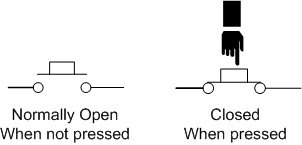
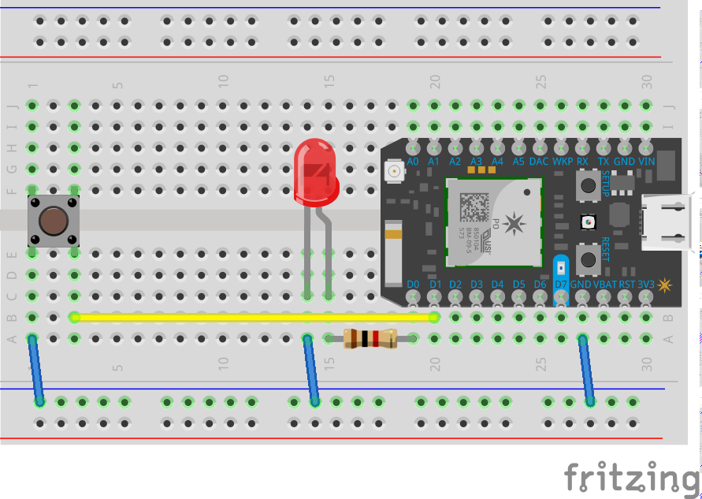

# Step 2: Turn and LED on and Off with a pushbutton

We're going to add a little more interactivity by introducing a simple input, a pushbutton, into our circuit. 

## Pushbuttons



It’s a pretty simple component. It has two terminals on either side. By pushing down on the button, it creates a connection between the terminals allowing electricity to flow. When you release the electricity can no longer flow.

In our code we use `digitalRead( pin )` to check the power flowing to a pin on our microcontroller. This method returns high or low

## Circuit

Make some changes to the circuit as follows:



- Add a pushbutton on the left hand side. 
- Wire one side to ground (`GND`)
- Wire the other to `D1`

Notice that we’ve wired the pushbutton to ground, and not to power. This is because unlike sensors we can use an internal pullup resistor to get consistent readings from the pushbutton. 

## Code

Use the LED code from Step 1 as a starting point for this sketch. The [completed code](code-by-end/LED.ino) is available in the folder above.

First add a new variable at the top of your code

`````
// Our button wired to D0
int buttonPin = D1;
`````

This says we're going to work with D1

Next in our setup we'll tell our microcontroller that we plan to use the button attached to D1 as a input like so

````
void setup()
{
   pinMode(ledPin, OUTPUT);

   // add this line... 
  pinMode( buttonPin , INPUT_PULLUP); // sets pin as input
}
````

And then we're going to change our loop to look like this:

`````
void loop()
{
    // find out if the button is pushed
    // or not by reading from it.
    int buttonState = digitalRead( buttonPin );

    // remember that we have wired the pushbutton to
    // ground and are using a pulldown resistor
    // that means, when the button is pushed,
    // we will get a LOW signal
    // when the button is not pushed we'll get a HIGH

    // let's use that to set our LED on or off

    if( buttonState == LOW )
    {
     // turn the LED On
     digitalWrite( ledPin, HIGH);
    }else{
     // otherwise
     // turn the LED Off
     digitalWrite( ledPin, LOW);

    }

}
`````

Let's break this down:

```    int buttonState = digitalRead( buttonPin ); ```

This reads the current state from the terminal. If the button is pushed, the value will change. Remember digitalRead gives us a `HIGH` or a `LOW` value.  If it's pushed, we'll get a `LOW` because it's connected to ground.

```    if( buttonState == LOW )```

An `if statement` allows us to test to see if a condition is true. In this case is the button pushed. If it is then everything inside the next set of curly braces `{` and `}` is performed. 

```     digitalWrite( ledPin, HIGH);```

Which is to turn the LED on

After the closing brace we see `else`. This is what happens if the condition isn't met i.e. what happens otherwise / when the button isn't pushed. 

Great. We're good to go now... 

### Compiling and sending to the Particle device

1. Make sure you save your sketch. 

1. Make sure the Status Bar (bottom of Particle Dev) has a device connected and the photon’s indicator is breathing blue. If not make sure your Photon is connected by USB and is getting a WiFi signal.

2. Press the Lightning bolt on the top left of the window.

3. You’ll see a message ‘Compiling in the Cloud’ and a few sections later your Photon should start flashing magenta.

4. Wait a few moments, it should return to breathing blue, and the LED should begin to flash!

## Press the button

Try it out by pressing the button on your circuit!


## Things to Try 

Instead of turning the LED On and off with the press, use the button to toggle the LED on or off 


