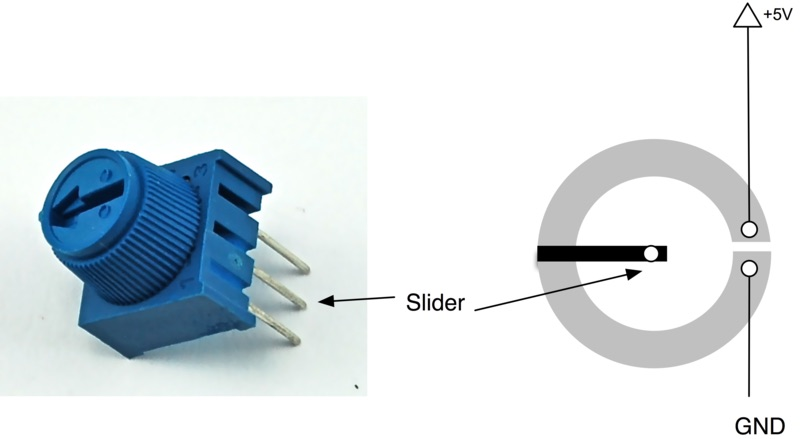
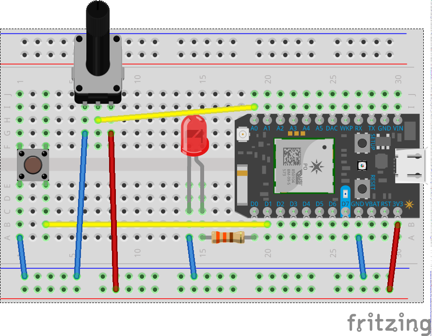

# Step 3: Fade with a Potentiometer

Another step towards our bigger goal. We'll add a potentiometer - another input component - where we can dial up and down. We'll use this to select cities in our final implementation, but in this step you'll add it to the circuit and get more familiar with how it works. 

## Potentiometer



A potentiometer is essentially a dimmer switch. As you dial it down, it becomes more resistive, allowing less electricity to flow. When you dial it up, it becomes less resistive. Inside the potentiometer, there’s a slider. This is what we connect to our circuit and read from. The slider moves along a circular track, and the track acts as a resistor. Turning the knob, moves the slider around the track. As it moves along, this track it increases or decreases the resistance and we can use this to determine the relative position of the slider.

In our code we use `analogRead( pin )` to read from an analog component (one that gives us a ranged value). This method returns a value from `0` to `4095`. 

__Using your potentiometer__

There's one in your kits. It has three pins. The outer two pins can be connected in either direction and to either Ground or Power. The middle terminal is connected to the slider (or the bit that moves) allowing us to read it’s 'position'.

When wiring a potentiometer, wire either left or the right terminal to ground; the remaining outer terminal to power (Vin or 3v3) and the middle terminal to an analog pin you want to read from.

Next we're going to wire up a potentiometer and allow you to fade up and down an LED as you turn the dial.

## Circuit

Make some changes to the circuit and add in the potentiometer: 

- Wire one side to ground (GND)
- Wire the other to Power (3V3)
- Wire the middle to A0



## Code

Use the LED code from Step 1 as a starting point for this sketch. The [completed code](code-by-end/LED.ino) is available in the folder above.

We'll start by adding three variables to the top of our code

1. The first will reference the pin that we're going to connect the potentiometer to `A0`
2. The second will store a value that we read from the potentiometer
3. The third will be a variable to store some info about the light levels (how much or how little have we faded it by)

````
// Define a pin that we'll place the pot on
int potPin = A0;

// Create a variable to hold the pot reading
int potReading = 0;

// Create a variable to store the LED brightness.
int ledBrightness = 0;
````

In this example we don't need to make any changes to the `setup()` so we'll focus on the `loop()`

First in our loop we'll read a value from `A0`. We'll use a function called analogRead to do this.

```
 // Use analogRead to read the potentiometer reading
  // This gives us a value from 0 to 4095
  potReading = analogRead(potPin);
````

Now we're going to want to be able to do more than just turn the power on or off (`HIGH` or `LOW`). THankfully there's a method that let's us do just that. It's `analogWrite`, unlike `digitalWrite` which turns the power just on or off to a pin `analogWrite` can (sort of) vary the power to a pin by using a trick called _pulse width modulation_. This essentially turns on and off the power to the pin really really fast (as much as several hundred times a second) and this simulates the conditions of lower power.Think about someone standing by a light switch and turning it on and off every second. Half the time its incredibly bright. Half the time its dark, but on average its sort of bright. This is essentially what pulse width modulation does. Anyway, that's more info than you need, but suffice to say it lets us 'fade down' an LED in 256 steps from 0 (off) to 127 (50%), to 255 (fully on). 

Let's try it out...

First we'll convert the potentiometer reading (between 0-4905) to the range of pwm control (0-255). 

````
  // Map this value into the PWM range (0-255)
  // and store as the led brightness
  ledBrightness = map(potReading, 0, 4095, 0, 255);
````

Then we'll control the output to the led like so

````
  // fade the LED to the desired brightness
  analogWrite(ledPin, ledBrightness);
````

For good measure add a short delay between looops

```
  // wait 1/10th of a second and then loop
  delay(100);
  
```

Et voila! You should be able to control the brightness of your LED perfectly now. 

The [completed code](code-by-end/LED.ino) is available in the folder above.

### Compiling and sending to the Particle device

1. Make sure you save your sketch. 

1. Make sure the Status Bar (bottom of Particle Dev) has a device connected and the photon’s indicator is breathing blue. If not make sure your Photon is connected by USB and is getting a WiFi signal.

2. Press the Lightning bolt on the top left of the window.

3. You’ll see a message ‘Compiling in the Cloud’ and a few sections later your Photon should start flashing magenta.

4. Wait a few moments, it should return to breathing blue, and the LED should begin to flash!

## Turn the Dial

Try it out by turning the potentiometer on your circuit!

## Things to Try 

Combine a switch and potentiometer. The switch should turn on and off the light while the potentiometer will fade up and down the light (but only when its on).

