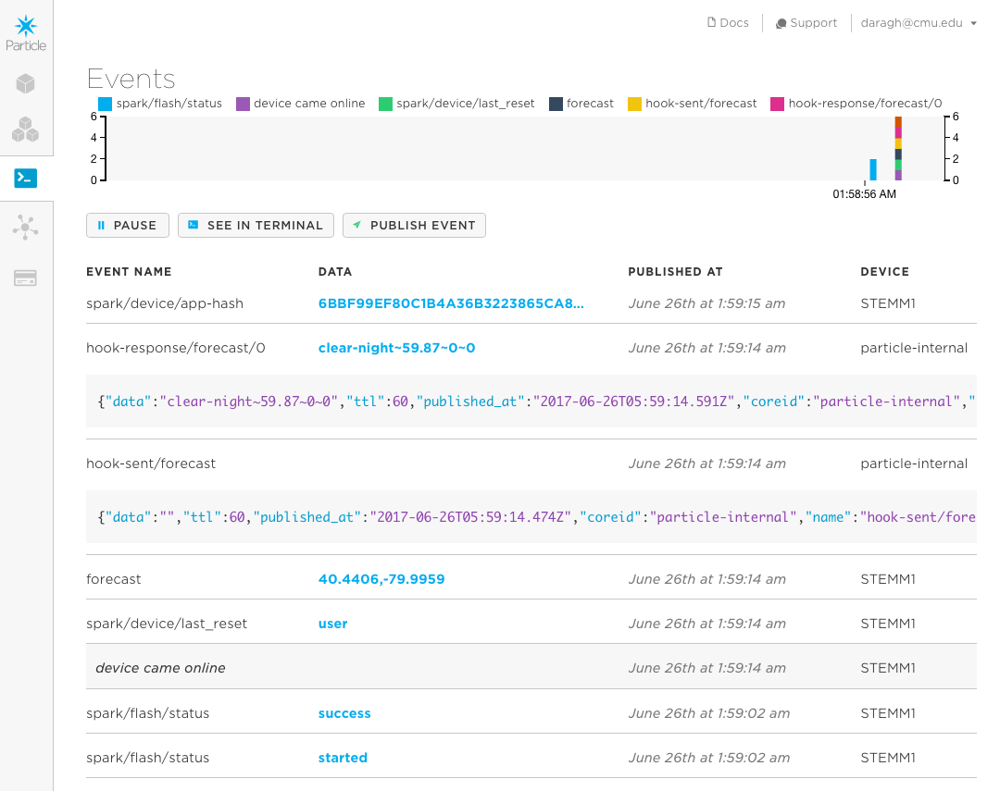

# Step 6: Ambient Weather

All the pieces are in place. We just need to bring them together...

But first, how do we know the weather? 

Particle allows us to make requests for bits of information online through something called "Webhooks".  

The way webhooks work is as follows:

1. Each webhook has a unique name and maps to some piece of information that's found online
1. When your photon wants some information from a webhook. And when it does it'll publish an event. That event will have the same name as the webhook. e.g. If I have a webhook called 'get-news-articles' then I'd send an event with the same name (Particle.publish('get-news-articles'))
2. The webhook will be triggered and it'll go off and find the bit of information we're looking for
3. When it's found it, it publishes a new event called 'hook-response/webhookname' that my decive is listening for. This event has the info we want in it.
4. My device gets the info and can do cool stuff. 

Before the workshop, I set up a webhook you can use. It's called `forecast`. It gets information from [DarkSky](https://darksky.net/forecast/40.5465,-80.0525/us12/en) - an online platform that specializes in weather forecasting and visualization. Perfect! 

The webhook asks for one bit of information - the latitude and longitude for the place you want weather info on - and it sends back four things:
- a label for the current weather in that location
- the temperature
- the probability of rain 
- the intensity of rain (millimeters per hour)

We're going to add these into our code and have it look up weather information for Pittsburgh (lat: 40.4406, lon: -79.9959)! 

### Starting point.

Let's start fresh after all those experiments. You might want to [copy and paste from this starting point](code-at-start/LED.ino) or create a new project using this code. As always the finished code for this step is in [the folder ](code-by-end/LED.ino) or create a new project using this code.


### Getting Weather Information

We're going to add two pieces of code to help get data on the weather in Pittsburgh

Copy and paste the following into the end of your code file

`````

void getData()
{
	// Publish an event to trigger the webhook
  Particle.publish("forecast", "40.4406,-79.9959", PRIVATE);
}

// This function will handle data received back from the webhook
void handleForecastReceived(const char *event, const char *data) {
  // Handle the integration response

  String receivedStr =  String( data );
  int loc1 = 0;
  int loc2 = 0;
  int loc3 = 0;
  int loc4 = 0;

  loc1 = receivedStr.indexOf("~");

  weatherIcon = receivedStr.substring(0,loc1);

  loc2 = receivedStr.indexOf("~",loc1+1);
  temperature = (double) String(receivedStr.substring(loc1+1,loc2)).toFloat();

  loc3 = receivedStr.indexOf("~",loc2+1);
  precipProbability = (double) String(receivedStr.substring(loc2+1,loc3)).toFloat();

  loc4 = receivedStr.indexOf("~",loc3+1);
  precipIntensity = (double) String(receivedStr.indexOf(loc3+1)).toFloat();


}
`````

Making progress.

Now you also need to tell your Photon to listen for the response to the webhook. To do this, add this line of code to the end of your `setup()`

`````
  Particle.subscribe("hook-response/forecast", handleForecastReceived, MY_DEVICES);

`````
This registers for the webhook response and maps it into the function we just added...

Now one last thing, we need to publish the event and trigger the webhook. Let's do this when the device first starts. To do this, add the following line right before the end of the `setup()`'s last curly bracket. 

````
	getData();
}
````

You know the drill. Save your code. Flash your code. Fingers crossed. It'll appear on your Particle!

To know if it worked, open up the console ([http://console.particle.io](http://console.particle.io)) and you should see something like this when the device restarts




