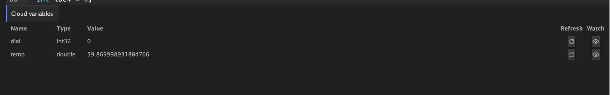

# Step 7: Displaying Temperature

We're going to visualize the weather from blue to red (cold to hot). To do this we're going to take the temperature value we receive from the webhook and map it into the RGB LED of the Photon.

We really only need the Red and Blue components, so the green will always be off.

The mapping will look like this:
- When it's hot (more than 100F) the R component will be high (close to 255), and the B component will be low (close to zero)
- When it's cold (50F or less) the R component will be low (close to 0), and the B component will be high (close to 255)

### Let's hook this up. 

In your code add the following method

````
void displayTemperature()
{
		// the temperature from 50-100F into the color range of 0-255
    int tCol = map( (int)(temperature), 50, 100 , 0 , 255 );
		// make sure its in that range 
		// not bigger or smaller!
    tCol = constrain( tCol, 0, 255 );
		
		// tell the photon we want to control
		// the RGB color
    RGB.control( true );

		// map the color in.
		// if t is high so is Red
		// if t is low, blue is high
    RGB.color( tCol , 0, 255 - tCol );
}

````

Now to display the temperature, you just need to call this method in your loop

Add this one line:

````
      displayTemperature();
````

Save your code. Flash your code and you should see the color change. 


### Seeing it online too

While we're at it, it's really easy to add a `Particle.variable` to see the actual value of the temperature quickly from the console. 

In setup() add the following to make the temperature value visible online. 

````
  Particle.variable("temp", &temperature, DOUBLE );
````

Save your code. Flash your code and you should see the color change. To view these variables in real time, you can do that from Particle Dev. Choose the `Particle` Menu (top right) and then select `Show Cloud Variables`. A new panel will open and after a few moments you should see something like this:



